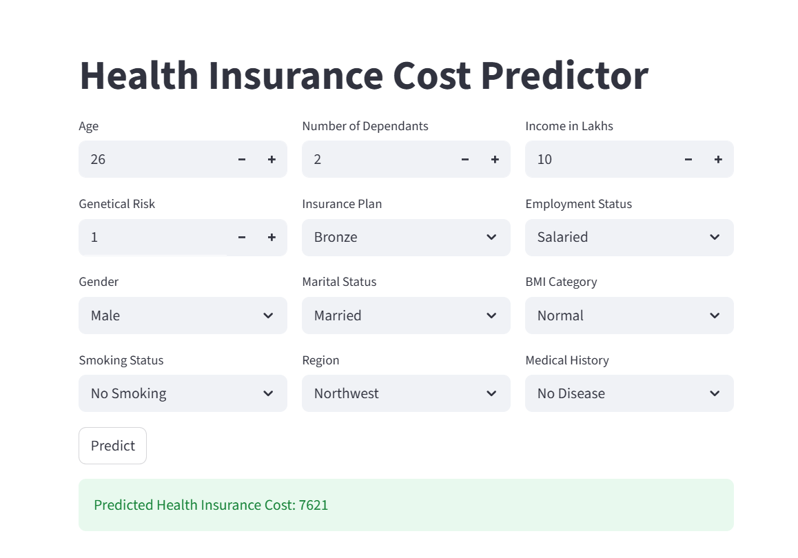

# 🏥 Health Insurance Cost Predictor

A Machine Learning web application that predicts health insurance premiums based on customer demographics, lifestyle, financial information, and medical history.

Built using **Python, XGBoost, Scikit-Learn, Joblib, and Streamlit**.

---

## 🚀 Features

- Real-time insurance cost prediction
- Interactive Streamlit interface
- Automatic model selection
- Separate models for different customer groups
- Fast and accurate predictions

---
## 📸 Application Screenshot


## 🧠 Model Architecture

This project uses a **segmented modeling approach** instead of a single model.

- **model_young.joblib** → Used for younger customers
- **model_rest.joblib** → Used for all other customers

The application automatically selects the appropriate model during prediction, helping improve prediction accuracy across different customer segments.

---

## 📊 Input Features

- Age
- Number of Dependants
- Income
- Genetic Risk
- Insurance Plan
- Employment Status
- Gender
- Marital Status
- BMI Category
- Smoking Status
- Region
- Medical History

---

## 🛠️ Tech Stack

- Python
- Pandas
- NumPy
- Scikit-Learn
- XGBoost
- Joblib
- Streamlit
- Jupyter Notebook

---

## 📂 Project Structure

```bash
├── artifacts/
│   ├── model_rest.joblib
│   ├── model_young.joblib
│   ├── scaler_rest.joblib
│   └── scaler_young.joblib
│
├── main.py
├── prediction_helper.py
├── requirements.txt
└── README.md
```

---

## 🔄 Workflow

1. Data Collection
2. Data Cleaning & Preprocessing
3. Feature Engineering
4. Model Training
5. Customer Segmentation
6. Automatic Model Selection
7. Insurance Cost Prediction
8. Deployment using Streamlit

---

## ▶️ Run Locally

```bash
git clone https://github.com/your-username/health-insurance-cost-predictor.git

cd health-insurance-cost-predictor

pip install -r requirements.txt

streamlit run main.py
```

---

## 📈 Business Use Cases

- Insurance Premium Estimation
- Customer Risk Assessment
- Automated Insurance Quotation
- Pricing Analytics

---

## 👨‍💻 Author

**Paras**

Aspiring Data Scientist | Machine Learning Enthusiast